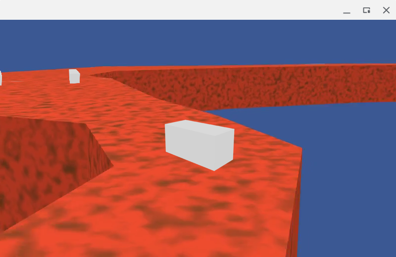

# BeautyDrive tech demo

Author: Lukas Straub <lukasstraub2@web.de>

BeautyDrive is a 3D racing game tech demo with a twist: It achieves a 3D look using only pre-rendered 2D graphics. Cars are rendered from all angles beforehand, and the racetrack itself is a pre-rendered video.

This is an old project of mine, the code does not adhere to current coding standards.



## Building

Install build dependencies:

```
apt-get install build-essential git libsdl2-dev libgstreamer1.0-dev \
    libgstreamer-plugins-base1.0-dev libpng-dev libglu-dev
```

and build:

```
make
```

## Building for older platforms

For older platforms (e.g. OpenPandora), you can build with SDL 1.2 and GStreamer 0.10:

```
make SDL_VERSION=1.2 GSTREAMER_VERSION=0.10
```

## Running

```
cd BeautyDrive
./BeautyDrive file:///<absolute-path-to>/BeautyDrive/data/lazy.mkv
```

## Controls

**Up:** Accelerate (be careful!) \
**Down:** Brake \
**Left/Right:** Steering \
**Escape:** Quit
